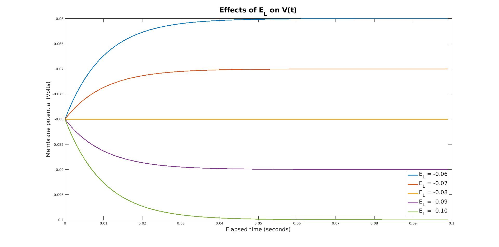

# Integrate and Fire Implementation

Provides MatLab implementations of the classic integrate-and-fire model of a neuron 
using both numerical simulation and theoretical derivation. 

## Code Layout
`integrate_and_fire.m` contains a functional implementation of the Integrate-and-Fire neuron 
in the `integrate_and_fire` function. This function takes in a vector `I_e` that contains one 
entry per time point for the applied current to the neuron at that time point. It also takes in 
`delta_t`, or the time increment being used for the calculations, and `t_total,` the total amount 
of time for which we will simulate the neuron. This function models the neuron using the standard
integrate-and-fire differential equation with the input `delta_t` and returns arrays corresponding to  
x (time) and y (membrane potential) which may be used in plotting, as well as a count of the number
of spikes the neuron reached during the simulation.

`plot_helper.m` provides a simple helper function that may be called with `x` and `y` vectors and a title 
string `ttl` and plots the results of the Integrate-and-Fire model, including appropriate axis labels. 

`theoretical_firing.m` takes in an applied current `I_e` (here `I_e` is a single number rather
than a vector), and calculates `T`, the time between two spikes, based on theoretical derivations
from the traditional Integrate-and-Fire differential equation. 

`V_t.m` takes in the resting membrane potential `E_L` and the membrane time constant `Tau_m` 
and calculates the progression of the Integrate-and-Fire model over 100 time points based on the
solved differential equation. These results could be compared to the numeric simulation as implemented
in `integrate_and_fire.m`

`main.m` conducts all of our main computations, separated by problem as follows: 

### Computational Simulation
#### Constant `I_e`
We begin by testing the most basic implementation fo the Integrate-and-Fire model by keeping `I_e` constant
across time and calling `integrate_and_fire` to compare different values of `I_e` and graphing the results by
calling the `plot_helper` function. For example, for `I_e = 1.6*10^-9 amperes,` our `integrate_and_fire` model
yields the following:

While investigating the effects of a constant `I_e`, we also consider the relationship between the magnitude of
the external current and the firing rate, measured as the number of spikes per second, by running `integrate_and_fire`
for one second on a variety of constant `I_e`s. The following step-wise relationship results: 

#### Varying `I_e`
Next, we test non-constant values of `I_e` by once again calling `integrate_and_fire` and graphing the results
with `plot_helper.` We test both stochiastically varying and periodic values for `I_e`, the applied current. When
looking at a stochiastically varying `I_e`, we compare multiple iterations to demonstrate the effects of randomness 
on firing rate and amplitude: 

For periodic functions, no such random variation occurs, but we can clearly observe the effects of a periodic,
sin-based `I_e` on the membrane potential: 

### Derivation 
#### Membrane Dynamics
Using the solved Integrate-and-Fire differential equation as implemented in `V_t`, we firstly investigate the
effects of the membrane time constant, `Tau_m`, on the membrane potential over time. As we can see, larger values
of `Tau_m` lead to a slower growth of the membrane potential as it approaches the resting membrane potential. 

Similarly, we may investigate the effect of the resting membrane potential `E_L` on the membrane potential over 
time. As we can see, `E_L` effects the point to which the membrane potential will eventually converge over time.

#### Applied Current and Firing Rate
Using the derived measure of firing rate based off of the Integrate-and-Fire differential equation, we can use
`theoretical_firing` to compare the derived and simulated firing rate across time. As we can see below, the 
derived firing rate provides an upper bound on the simulated step-wise function, and they match particularly 
well for small `I_e`:

